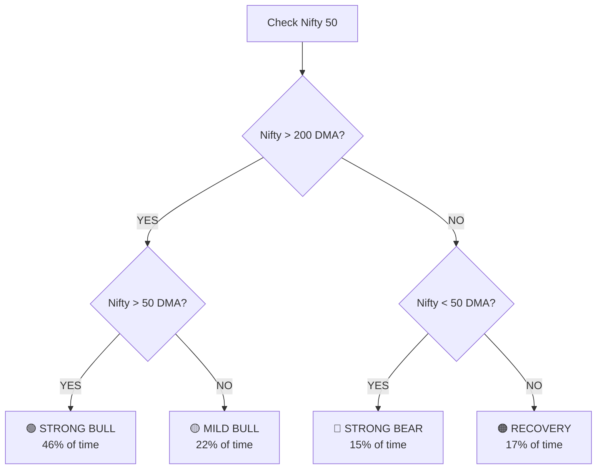
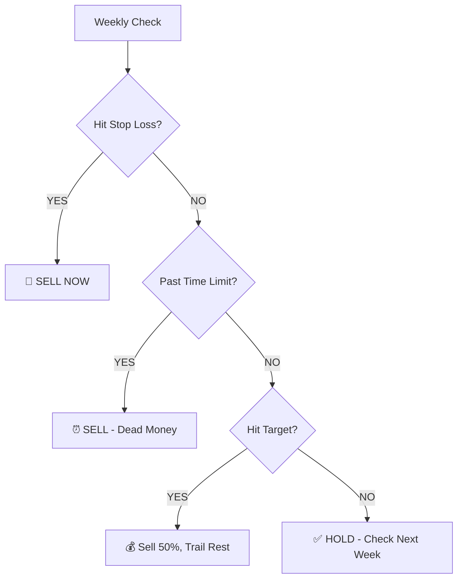
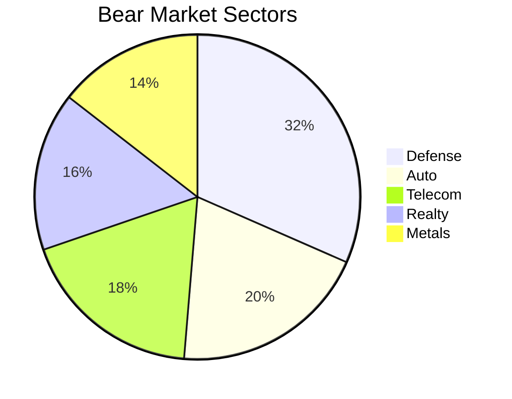

# 🎯 The Ultimate Action Guide for Indian Markets

**Your Complete Trading System | 18 Years of Data | 104 Stocks | Ready to Execute**

---

## 🔍 Step 1: What's the Market Doing Right Now?



---

## 📊 Step 2: Pick Your Strategy

### 🔴 STRONG BEAR (Rare but Powerful)

> [!TIP]
> **74% Win Rate | 55% Return in 6 Months**

| What | How |
|:-----|:----|
| **Find** | Stocks with Trend Score 0-20 |
| **Volume** | Jump (high volume = capitulation) |
| **Sectors** | Defense, Auto, Metals, Banking |
| **Stop** | -22% |
| **Hold** | 6 months minimum |

---

### 🟠 RECOVERY (Best Risk/Reward) ⭐

> [!IMPORTANT]
> **76% Win Rate | 12% Return | Only -7% Pain**

| What | How |
|:-----|:----|
| **Find** | Stocks with Trend Score 20-40 |
| **Volume** | Flat (quiet strength) |
| **Sectors** | IT, Banking, Industrials |
| **Stop** | -10% |
| **Hold** | 90 days |

---

### 🟡 MILD BULL (Quality Dips)

> [!NOTE]
> **61% Win Rate | 22% Return in 90 Days**

| What | How |
|:-----|:----|
| **Find** | Stocks with Trend Score 0-20 |
| **Volume** | Big Drop (selling exhausted) |
| **Sectors** | Consumer, Pharma, IT |
| **Stop** | -16% |
| **Hold** | 90 days |

---

### 🟢 STRONG BULL (Ride Momentum)

> [!NOTE]
> **60% Win Rate | 14% Return in 90 Days**

| What | How |
|:-----|:----|
| **Find** | Stocks with Trend Score 60-80 |
| **Volume** | Big Drop (consolidation) |
| **Sectors** | Metals, Industrials, Auto |
| **Stop** | -15% |
| **Hold** | 90 days |

---

## ⏱️ Step 3: Know When to Sell



### Time Limits (If stock won't move, sell it)

| Holding Period | Max Days Underwater |
|:---------------|:--------------------|
| 90 days | 45 days |
| 6 months | 100 days |
| 1 year | 150 days |

---

## 🛡️ Step 4: Stop Losses (Non-Negotiable)

> [!CAUTION]
> **If price drops below these levels, EXIT IMMEDIATELY. No exceptions.**

| Holding Period | Stop Loss |
|:---------------|:----------|
| 60 days | -12% |
| 90 days | -15% |
| 6 months | -20% |
| 1 year | -22% |

---

## 📈 Sector Rankings

### Best Sectors by Market Condition



| Bear Market | Bull Market |
|:------------|:------------|
| 1. Defense | 1. Metals |
| 2. Auto | 2. Industrials |
| 3. Telecom | 3. IT |
| 4. Realty | 4. Consumer |
| 5. Metals | 5. Banking |

---

## ✅ Pre-Trade Checklist

Before you click "Buy":

- [ ] **Regime:** I know if we're in Bull/Bear/Recovery
- [ ] **Trend:** Stock's Trend Score matches my strategy
- [ ] **Volume:** Volume pattern is right
- [ ] **Sector:** Sector matches the regime
- [ ] **Stop:** Stop loss is SET (written down)
- [ ] **Time:** Exit date is marked on calendar
- [ ] **Size:** Position is max 10% of portfolio

---

## 📋 Wallet Card (Print This)

```
╔══════════════════════════════════════════════════════════╗
║              QUICK REFERENCE CARD                        ║
╠══════════════════════════════════════════════════════════╣
║  REGIME       │ TREND  │ STOP  │ WIN%  │ TARGET         ║
║───────────────┼────────┼───────┼───────┼────────────────║
║  🔴 Bear      │ 0-20   │ -22%  │  74%  │ 55% (6mo)      ║
║  🟠 Recovery  │ 20-40  │ -10%  │  76%  │ 12% (90d) ⭐   ║
║  🟡 Mild Bull │ 0-20   │ -16%  │  61%  │ 22% (90d)      ║
║  🟢 Strong Bull│ 60-80  │ -15%  │  60%  │ 14% (90d)      ║
╠══════════════════════════════════════════════════════════╣
║  TIME LIMITS: 90d=45 days │ 6mo=100 days │ 1yr=150 days ║
╚══════════════════════════════════════════════════════════╝
```

---

## 📊 The Proof (This Actually Works)

| Era | Strong Bear Win% | Recovery Win% | Validated? |
|:----|:-----------------|:--------------|:-----------|
| 2008-2022 | 63% | 62% | ✅ |
| 2022-2026 | **74%** | **76%** | ✅ Better! |

> Based on **104 stocks**, **18 years** of data, **19,342 signals**

---

## 🎯 Today's Action

1. **Check Nifty** vs 50DMA and 200DMA
2. **Identify regime** (Bull/Bear/Recovery)
3. **Scan for setups** matching that regime
4. **Set stops BEFORE** you buy
5. **Execute** with discipline

---

*The system works. Trust the data. Execute the plan.*

