# 🦅 The Alpha Hunter's Dashboard
## Your Daily Cockpit for Wealth Creation

---

## 🧭 Market Regime Radar

```mermaid
graph TD
    NIFTY[NIFTY 50 PRICE]
    
    subgraph BEAR_TERRITORY [🔴 FEAR ZONE]
        direction TB
        BEAR[STRONG BEAR<br/>Price < 50 < 200 DMA]
        REC[RECOVERY<br/>50 crosses 200 DMA]
    end
    
    subgraph BULL_TERRITORY [🟢 GREED ZONE]
        direction TB
        MILD[MILD BULL<br/>Price > 200, Rangebound]
        STRONG[STRONG BULL<br/>Price > 50 > 200 DMA]
    end
    
    NIFTY --> BEAR
    NIFTY --> REC
    NIFTY --> MILD
    NIFTY --> STRONG
    
    BEAR -->|Strategy| HUNT(Hunt for Panic)
    REC -->|Strategy| LOAD(Load the Truck)
    MILD -->|Strategy| SNIPE(Snipe Quality Dips)
    STRONG -->|Strategy| RIDE(Ride Momentum)
    
    classDef red fill:#ffcccc,stroke:#ff0000,stroke-width:2px;
    classDef green fill:#ccffcc,stroke:#00ff00,stroke-width:2px;
    classDef yellow fill:#ffffcc,stroke:#eeee00,stroke-width:2px;
    classDef orange fill:#ffeedd,stroke:#ff8800,stroke-width:2px;
    
    class BEAR,HUNT red;
    class STRONG,RIDE green;
    class MILD,SNIPE yellow;
    class REC,LOAD orange;
```

---

## 🧠 The Psychological Edge

| Zone | Market Emotion | Your Emotion | Action | Alpha Potential |
|:-----|:---------------|:-------------|:-------|:----------------|
| 🔴 **Bear** | **PANIC** | **COURAGE** | Buy when others vomit | 🚀 **107% (3yr)** |
| 🟠 **Recovery** | **DISBELIEF** | **CONVICTION** | Buy before they believe | ⭐ **Best Risk/Reward** |
| 🟡 **Mild Bull** | **BOREDOM** | **PATIENCE** | Buy quality on sale | 📈 **Solid (22%)** |
| 🟢 **Strong Bull** | **EUPHORIA** | **DISCIPLINE** | Trail stops, don't chase | 🛡️ **Protect Capital** |

> *"Wealth is transferred from the Impatient to the Patient, and from the Fearful to the Courageous."*

---

## 💰 The Capital Allocator

### In a Bear Market (Aggressive)

### In a Bull Market (Balanced)

---

## 🛡️ The Shield (Risk Rules)

> [!WARNING]
> **VIOLATING THESE RULES = FINANCIAL SUICIDE**

### 1. The Exit Matrix
| Horizon | 🛑 Stop Loss | ⏱️ Time Stop |
|:--------|:-------------|:-------------|
| **Swing (90d)** | **-15%** | **45 Days** |
| **Position (6mo)** | **-20%** | **100 Days** |
| **Invest (3yr)** | **-25%** | **18 Months** |

### 2. The Golden Rule of Ruin
*Never risk more than 1% of total capital on a single trade.*
*Example: If portfolio is ₹10L and stop is 20%, max position size is ₹50k (5%).*

---

## 🌅 The Morning Ritual

**Checklist for 9:00 AM:**

- [ ] **1. Regime Check:** Where is Nifty vs 200DMA?
- [ ] **2. Portfolio Scan:** Any stops hit? Any time limits crossed?
- [ ] **3. Opportunity Map:** 
    - *If Bear:* Scan for Trend 0-20 + Jump Volume
    - *If Bull:* Scan for Trend 60-80 + Big Drop Volume
- [ ] **4. Execution:** Place orders with GTT (Good Till Triggered) stops.
- [ ] **5. Close Screen:** Go live your life. The math is working.

---

## 📜 The Trader's Oath

> "I will not predict. I will react."
> "I will not hope. I will calculate."
> "I will not argue with price. I will obey the stop."
> "I am a hunter of alpha, not a gambler of luck."

---

*Validated through February 2026 | 19,342 Signals | 104 Stocks*

