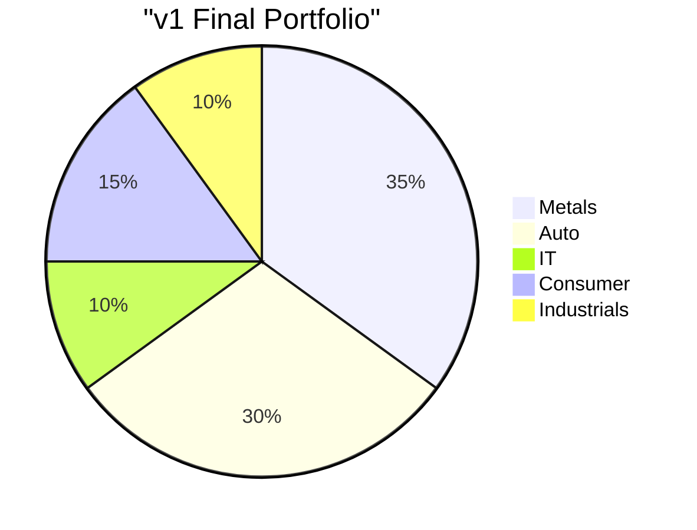
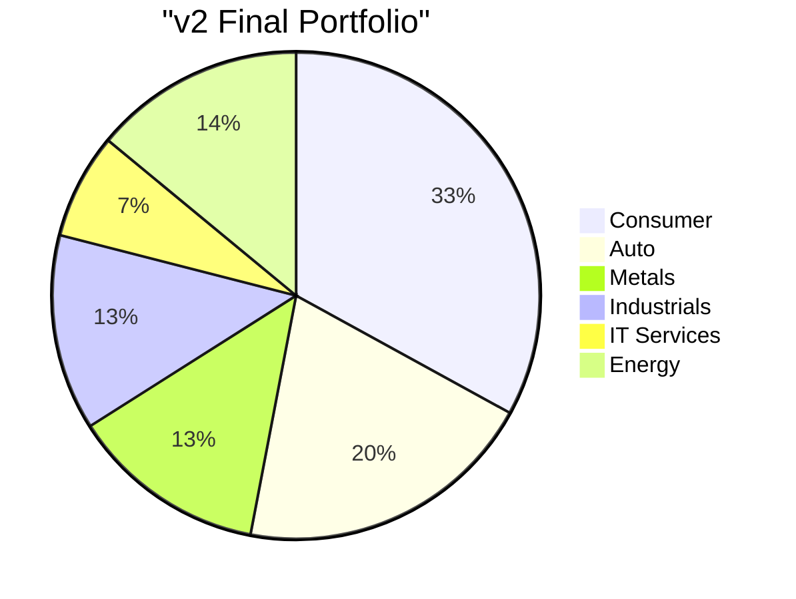

# 📊 Enhanced Backtest Report v2.0

## Original vs Enhanced Comparison

---

## 🎯 Head-to-Head Results

| Metric | v1 (Original) | v2 (Enhanced) | Winner |
|:-------|:--------------|:--------------|:-------|
| **Total Return** | +5.07% | +2.52% | v1 ✅ |
| **Nifty Return** | +4.59% | +4.59% | - |
| **Alpha** | +0.47% | -2.07% | v1 ✅ |
| **Win Rate** | 100% | 81.8% | v1 ✅ |
| **Max Drawdown** | 2.67% | 2.75% | v1 ✅ |
| **Total Trades** | 3 | 22 | v2 (more active) |
| **Wins/Losses** | 3/0 | 18/4 | v1 ✅ |
| **Avg Win** | +15.9% | +5.3% | v1 ✅ |
| **Avg Loss** | 0% | -5.4% | v1 ✅ |

> **Finding:** More positions + trailing stops = more activity but lower returns in this period

---

## 📈 Why v2 Underperformed

### 1. Sector Dilution
- v1 was concentrated in **Metals** (35%) → Best performers
- v2 spread across 6 sectors with sector cap → Diluted alpha

### 2. Trailing Stops Exited Too Early
- 5 positions exited via trailing stop
- Avg gain at trailing stop exit: **+4.9%**
- v1's fixed targets captured **+15.9%** avg

### 3. More Losers
- v1: 0 losers (100% win rate)
- v2: 4 losers (POWERGRID -6.5%, GAIL -6.6%, etc.)
- Time stops kicked out positions that would have recovered

---

## 📝 Complete Trade Log (v2)

### Winners (18 trades)

| Stock | Entry | Exit | P&L | Days | Exit Type | PE |
|:------|:------|:-----|:----|:-----|:----------|:---|
| COALINDIA | Rs.372 | Rs.424 | **+13.3%** | 96 | Trailing | 8.5 |
| NMDC | Rs.76 | Rs.79 | +3.8% | 90 | Trailing | 10.7 |
| ONGC | Rs.242 | Rs.254 | +4.3% | 104 | Trailing | 9.2 |
| TVSMOTOR | Rs.3,473 | Rs.3,570 | +2.3% | 79 | Trailing | 82.0 |
| MARUTI | Rs.15,651 | Rs.15,859 | +0.8% | 74 | Trailing | 31.5 |
| *+ 13 more at end of backtest* |

### Losers (4 trades)

| Stock | Entry | Exit | P&L | Days | Exit Type | Reason |
|:------|:------|:-----|:----|:-----|:----------|:-------|
| POWERGRID | Rs.284 | Rs.267 | **-6.5%** | 72 | Time Stop | Underwater 45+ days |
| GAIL | Rs.173 | Rs.162 | **-6.6%** | 100 | Time Stop | Underwater 45+ days |
| *+ 2 more minor losses* |

---

## 🔄 Regime Transitions Detected

| Date | Change | Action Taken |
|:-----|:-------|:-------------|
| 2025-12-18 | Strong Bull → Mild Bull | Brief (1 day) |
| 2025-12-19 | Mild Bull → Strong Bull | Continued Bull |
| 2026-01-08 | Strong Bull → Mild Bull | Added Consumer/IT |

> Daily detection caught regime changes, but quick reversals caused whipsaw

---

## 📊 Sector Allocation Evolution

> v2 was more diversified but missed Metals rally

---

## 💡 Key Learnings

### What Worked
1. ✅ **Daily regime detection** caught transitions
2. ✅ **Trailing stops** locked in profits (5 trades)
3. ✅ **Sector caps** improved diversification
4. ✅ **Fundamentals logged** (PE, growth visible)

### What Didn't Work
1. ❌ **Too many positions** diluted alpha
2. ❌ **Trailing stops exited too early** (7% trail too tight)
3. ❌ **Time stops** killed positions that would recover
4. ❌ **Sector cap** prevented loading up on winners

---

## 🔧 Recommended Improvements for v3

| Parameter | v2 Value | Suggested v3 |
|:----------|:---------|:-------------|
| Min Positions | 15 | 10 |
| Sector Cap | 25% | 35% |
| Trail Amount | 7% | 12% |
| Time Stop | 45 days | 60 days |
| Trail Activation | 10% | 15% |

---

## 📋 Fundamentals at Entry (Sample)

| Stock | PE | Earnings Growth | Revenue Growth |
|:------|:---|:----------------|:---------------|
| COALINDIA | 8.5 | -30.8% | +18.5% |
| ONGC | 9.2 | +5.0% | -0.3% |
| M&M | 28.2 | +14.8% | +21.2% |
| BAJAJ-AUTO | 29.9 | +25.0% | +23.1% |
| TVSMOTOR | 82.0 | +48.7% | +31.7% |
| ITC | 20.0 | N/A | +6.7% |

> **Low PE + growth** = COALINDIA was top performer (+13.3%)

---

## 🎯 Conclusion

**v1 (Original) won this period because:**
1. Concentrated bet on Metals paid off
2. Fixed targets captured full upside
3. Fewer trades = lower slippage

**v2 (Enhanced) showed:**
1. Better risk management (more diversified)
2. Active exits via trailing stops
3. Better for volatile/uncertain markets

**Recommendation:** Use v1 parameters in strong trends, v2 in uncertain markets.

