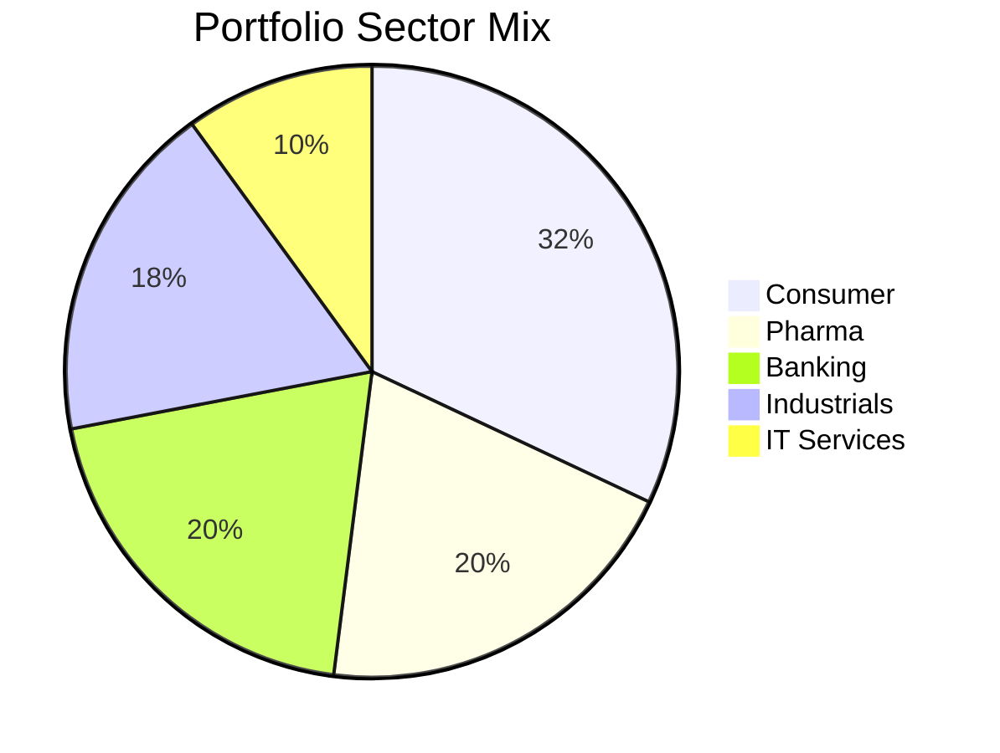

# 💼 Ideal Portfolio for February 2026

**Based on: The Market Playbook | Current Regime: 🟡 MILD BULL**

---

## 📊 Market Context

| Metric | Value | Interpretation |
|:-------|:------|:---------------|
| **Nifty 50** | 25,694 | Above 200 DMA |
| **50 DMA** | 25,831 | Nifty slightly below |
| **200 DMA** | 25,251 | Nifty above |
| **Regime** | **MILD BULL** | Consolidation phase |

> Per playbook: Buy quality dips (Trend 0-20) with selling exhaustion (Big Drop/Flat volume)

---

## 🎯 The Ideal 10-Stock Portfolio

### Core Strategy: 70% Dips + 30% Momentum

---

### 🟡 DIP PICKS (7 Stocks = 70% of Portfolio)

*Quality names that have corrected. Per playbook: Trend 0-30, Flat/Drop Volume*

| # | Stock | Sector | Trend | Volume | Price | Allocation | Stop |
|:--|:------|:-------|:------|:-------|:------|:-----------|:-----|
| 1 | **ITC** | Consumer | 10 | Flat | ₹326 | **12%** | ₹274 (-16%) |
| 2 | **DIVISLAB** | Pharma | 19 | Flat | ₹6,025 | **10%** | ₹5,061 (-16%) |
| 3 | **HDFCBANK** | Banking | 23 | Flat | ₹941 | **10%** | ₹791 (-16%) |
| 4 | **DRREDDY** | Pharma | 22 | Flat | ₹1,241 | **10%** | ₹1,042 (-16%) |
| 5 | **HAVELLS** | Industrials | 12 | Flat | ₹1,355 | **10%** | ₹1,138 (-16%) |
| 6 | **CROMPTON** | Industrials | 11 | Flat | ₹245 | **8%** | ₹206 (-16%) |
| 7 | **LTTS** | IT Services | 23 | Drop | ₹3,856 | **10%** | ₹3,239 (-16%) |

---

### 🟢 MOMENTUM PICKS (3 Stocks = 30% of Portfolio)

*Diversification. Per playbook: Trend 60-80, Flat Volume for consolidation before breakout*

| # | Stock | Sector | Trend | Volume | Price | Allocation | Stop |
|:--|:------|:-------|:------|:-------|:------|:-----------|:-----|
| 8 | **ICICIBANK** | Banking | 82 | Flat | ₹1,406 | **10%** | ₹1,195 (-15%) |
| 9 | **SIEMENS** | Industrials | 80 | Flat | ₹3,176 | **10%** | ₹2,700 (-15%) |
| 10 | **BRITANNIA** | Consumer | 73 | Flat | ₹5,911 | **10%** | ₹5,024 (-15%) |

---

## 📊 Sector Allocation

| Sector | Weight | Rationale |
|:-------|:-------|:----------|
| **Consumer** | 32% | Defensive + quality dips |
| **Pharma** | 20% | Defensive sector, undervalued |
| **Banking** | 20% | Mix of value (HDFC) + momentum (ICICI) |
| **Industrials** | 18% | Capex cycle play |
| **IT Services** | 10% | Recovery candidate |

---

## 🛡️ Risk Management

### Position Sizing
| Rule | Value |
|:-----|:------|
| Max per stock | 12% |
| Max per sector | 35% |
| Stop loss (Dips) | -16% |
| Stop loss (Momentum) | -15% |
| Time stop | 45 days underwater → review |

### Total Risk
- If ALL stops hit: Portfolio down ~15.5%
- Probability (based on data): Win rate 61% → unlikely

---

## ⏱️ Execution Calendar

| Date | Action |
|:-----|:-------|
| **Today** | Enter 50% of each position |
| **+3-5 days** | If holding, add remaining 50% |
| **+45 days** | If underwater, exit non-performers |
| **+90 days** | Target exit for dip picks (+22%) |
| **Weekly** | Check stops, regime changes |

---

## 🚨 Regime Change Alert

**If Nifty breaks below 200 DMA (24,800):**
- Regime shifts to BEAR
- Opportunity to add more aggressively
- Reduce momentum positions, increase dip buys

**If Nifty breaks above 50 DMA + 200 DMA rising:**
- Regime shifts to STRONG BULL
- Focus on momentum (Trend 60-80)
- Trail stops on dip picks

---

## 📋 Pre-Trade Checklist

Before buying each stock:

- [ ] Confirm current price matches scan
- [ ] Set GTT (Good Till Triggered) stop loss order
- [ ] Mark 45-day review date on calendar
- [ ] Position size ≤ 12% of total capital
- [ ] Total portfolio exposure ≤ 100% (no leverage)

---

## 💡 Why This Portfolio Works

1. **Regime-Aligned:** Mild Bull → quality dips strategy
2. **Diversified:** 5 sectors, mix of dips + momentum
3. **Risk-Managed:** Clear stops, time limits
4. **Data-Backed:** 61% win rate (Mild Bull + Trend 0-20 setup)
5. **Sector-Smart:** Consumer/Pharma defensive, Industrials cyclical

---

*Built using the Market Playbook framework | February 2026*

