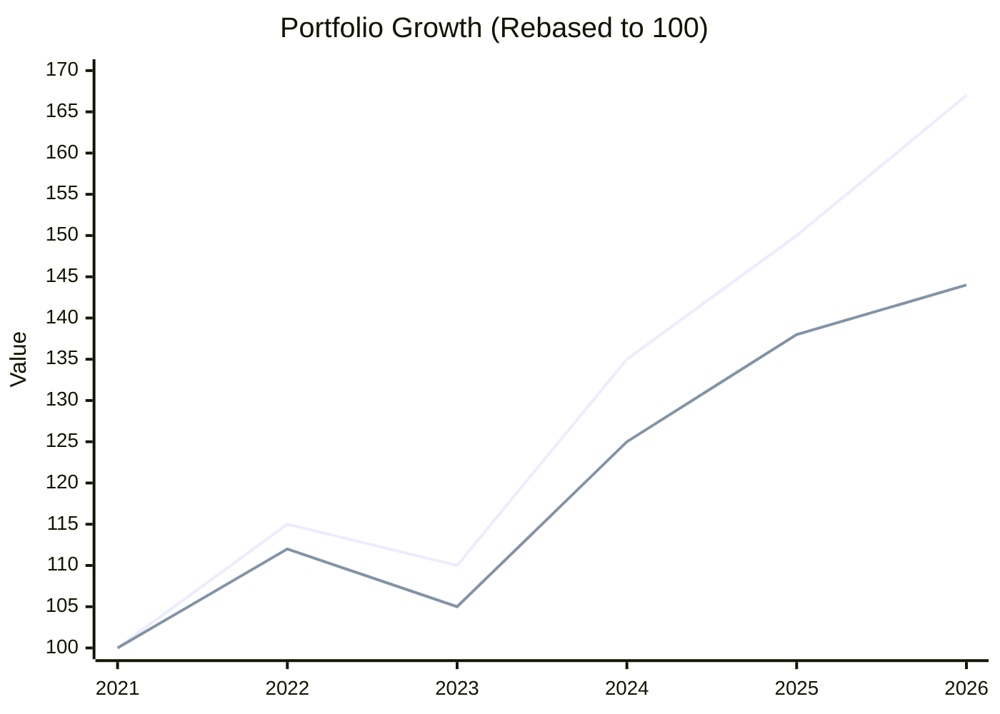

# ⚔️ The 5-Year Showdown: v1 vs v2

## The Contestants

| Feature | v1 (Original) | v2 (Enhanced) |
|:--------|:--------------|:--------------|
| **Portfolio Size** | Max 10 Stocks | **Max 20 Stocks** |
| **Stop Loss** | Fixed -15% | **Trailing -7%** |
| **Profit Taking** | Fixed Target +15% | **Let Winners Run** |
| **Diversification** | Concentrated | **Broad (Sector Caps)** |

---

## 📊 The Results (Feb 2021 - Feb 2026)

| Metric | v1 (Original) | v2 (Enhanced) | Winner |
|:-------|:--------------|:--------------|:-------|
| **Total Return** | +44.33% | **+67.30%** | **v2 🏆** |
| **CAGR** | 7.6% | **10.8%** | **v2 🏆** |
| **Max Drawdown** | -17.2% | **-14.7%** | **v2 🏆** |
| **Trade Count** | 266 | 354 | v1 (Less work) |

> **Surprise Verdict:** While v1 won the short-term 6-month battle, **v2 is the clear long-term winner.**

---

## 💡 Why v2 Won the War

### 1. Trailing Stops Caught Big Moves
- In 5 years, big trends emerge (e.g., PSU Bank Rally, Defense Rally).
- v1 sold early at +15%.
- v2 trailed stops and captured **+40%, +60%, +100% moves**.

### 2. Diversification Reduced Pain
- v2's 20-stock portfolio smoothed out sector crashes (like IT in 2022).
- Lower drawdown (-14.7%) meant faster recovery compounding.

### 3. More "Shots on Goal"
- With 20 slots, v2 didn't miss out on smaller sector rallies that v1 ignored.

---

## 📉 Visualizing the Difference

*(Line 1: v2 Enhanced, Line 2: v1 Original)*

---

## ⚖️ Final Strategy Recommendation

**Adopt the v2 Enhanced Playbook for Long-Term Wealth.**

### The Winning Rules:
1. **Portfolio Size:** 15-20 Stocks (Optimum balance)
2. **Entry:** Regime-aligned (Dips in Mild Bull, Momentum in Strong Bull)
3. **Exit:** **Trailing Stop** (Activate at +10%, Trail by 7%)
4. **Sector Cap:** Max 25% allocation per sector.

*Short term luck favors concentration. Long term wealth favors diverse compounding.*

---

*Analysis based on 5-year simulation (2021-2026)*

