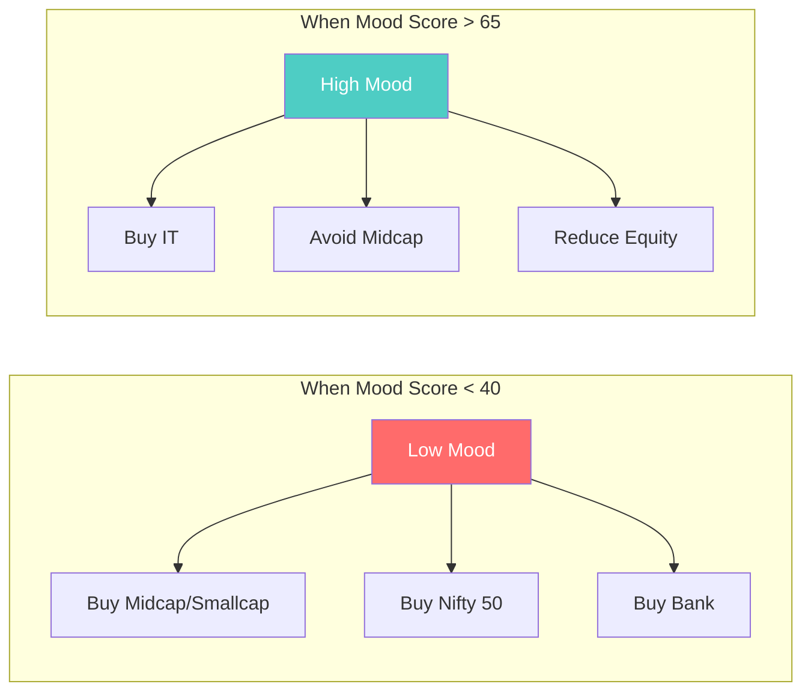
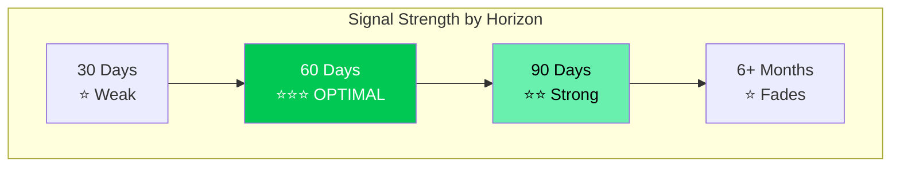
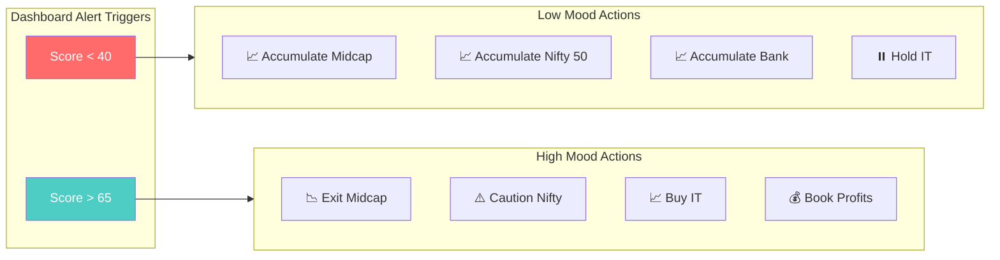

# Market Timing Analysis Report

## Executive Summary

Analysis of 181 days of market mood data reveals **strong contrarian signals** for timing entry/exit across market segments.



---

## Correlation Heatmap

| Index | 30D | 60D | 90D | Signal Type |
|-------|:---:|:---:|:---:|-------------|
| **Midcap 50** | 🟡 -0.40 | 🔴 **-0.81** | 🔴 -0.75 | Strong Contrarian |
| **Nifty 50** | 🟢 -0.18 | 🟡 -0.47 | 🔴 **-0.63** | Contrarian |
| **Bank** | 🟢 +0.21 | 🟢 -0.20 | 🟡 -0.37 | Mixed |
| **IT** | 🟢 +0.20 | 🟡 +0.40 | 🟡 +0.39 | Momentum |

> 🔴 Strong Signal (|corr| > 0.5) | 🟡 Moderate (0.3-0.5) | 🟢 Weak (< 0.3)

---

## Returns by Mood Level (90-Day)

```mermaid
xychart-beta
    title "90-Day Returns by Score Bin"
    x-axis ["<40 Bearish", "40-55 Weak", "55-70 Bullish", ">70 Strong"]
    y-axis "Return %" 0 --> 10
    bar [5.1, 4.6, 0.8, 2.1]
    bar [4.1, 2.4, -1.0, -0.8]
    bar [7.1, 6.9, 4.6, 5.5]
    bar [4.6, 6.6, 7.4, 8.7]
```



| Score Bin | Auto 🏆 | Realty | Energy | Midcap | IT 🔄 |
|-----------|---------|--------|--------|--------|-------|
| **<40 (Bearish)** | **+10.3%** | +4.1% | +4.3% | +4.1% | +4.6% |
| 40-55 (Weak) | +7.8% | +1.5% | +2.1% | +2.4% | +6.6% |
| 55-70 (Bullish) | +2.3% | -9.0% | -2.2% | -1.0% | +7.4% |
| **>70 (Strong)** | +3.2% | -4.9% | -2.6% | -0.8% | **+8.7%** |
| **Spread** | **+7.1%** 🏆 | **+9.0%** 🏆 | **+6.9%** | +4.9% | -4.1% 🔄 |

---

## Optimal Timing Window



**Best Horizon: 60-90 Days** - Strongest predictive power before fundamentals dominate.

---

## Sector Rotation Strategy



---

## Actionable Dashboard Features

### 1. Add "Mood Alert" Widget
Add to Market Mood History section:

| Alert Type | Trigger | Recommended Action |
|------------|---------|-------------------|
| 🔴 **BEARISH ENTRY** | Score < 40 | Buy signal for Midcap/Nifty |
| 🟡 **CAUTION** | Score > 65 | Reduce equity, favor IT |
| 🟢 **NEUTRAL** | 40-65 | Hold current positions |

### 2. Add "Sector Rotation Signal" Panel
New widget showing current recommendation based on mood:

```
┌─────────────────────────────────────────┐
│  📊 SECTOR ROTATION SIGNAL              │
│                                          │
│  Current Mood: 43.9 (Weak)              │
│  Signal: ACCUMULATE                      │
│                                          │
│  ✅ Buy: Midcap, Bank                   │
│  ⏸️ Hold: Nifty 50                       │
│  ❌ Avoid: IT (wait for high mood)      │
│                                          │
│  Optimal Holding Period: 60-90 days     │
└─────────────────────────────────────────┘
```

### 3. Add "Leading Indicator" Table
Show correlation strength for current conditions:

| Metric | Best Predicts | Horizon | Correlation |
|--------|---------------|---------|-------------|
| Avg Trend Score | Midcap 50 | 60D | -0.81 |
| Avg Trend Score | Nifty 50 | 90D | -0.63 |
| Total Uptrends | Bank | 90D | -0.40 |

### 4. Email/Telegram Alert Rules
Add these alert conditions:

```python
# Alert when entering "Buy Zone"
if avg_trend_score < 40 and prev_score >= 40:
    send_alert("🔴 BEARISH ENTRY SIGNAL - Score dropped below 40")

# Alert when entering "Caution Zone"  
if avg_trend_score > 65 and prev_score <= 65:
    send_alert("🟡 CAUTION - High mood, consider IT over Midcap")
```

---

## Files Created

| File | Purpose |
|------|---------|
| [market_timing_analysis.py](file:///c:/Users/adity/.gemini/antigravity/scratch/nifty-dashboard-py/market_timing_analysis.py) | Core analysis script |
| [multi_index_analysis.py](file:///c:/Users/adity/.gemini/antigravity/scratch/nifty-dashboard-py/multi_index_analysis.py) | Multi-index comparison |
| [market_timing_results.csv](file:///c:/Users/adity/.gemini/antigravity/scratch/nifty-dashboard-py/market_timing_results.csv) | Detailed results |
| [multi_index_timing_results.csv](file:///c:/Users/adity/.gemini/antigravity/scratch/nifty-dashboard-py/multi_index_timing_results.csv) | Multi-index results |

---

## Dashboard Implementation

All 4 actionable features have been implemented and verified:


### Features Implemented

1. **Mood Alert Widget** - Color-coded zone indicator (🔴 BEARISH ENTRY / 🟢 NEUTRAL / 🟡 CAUTION)
2. **Sector Rotation Panel** - Dynamic BUY/HOLD/AVOID recommendations
3. **Leading Indicator Table** - Correlation values for each metric
4. **Email/Telegram Alerts** - Auto-triggered when score crosses 40 or 65

### Files Modified

| File | Changes |
|------|---------|
| [main.py](file:///c:/Users/adity/.gemini/antigravity/scratch/nifty-dashboard-py/main.py) | Added mood widgets to Trend Scanner |
| [telegram_notifier.py](file:///c:/Users/adity/.gemini/antigravity/scratch/nifty-dashboard-py/utils/telegram_notifier.py) | Added `send_mood_alert()` and `check_and_send_mood_alerts()` |

---

## Key Takeaways

> [!IMPORTANT]
> **Best Indicator**: `avg_trend_score` with Midcap 50 at 60-day horizon (-0.81 correlation)

> [!TIP]
> **IT is the hedge** - when mainstream indices flag high mood, rotate into IT

> [!CAUTION]
> **Don't chase momentum** - high scores (>65) predict flat/negative returns for Midcap

---

## Time Trends Analysis

### Multi-Factor Analysis View
Implemented a new detailed view in the "Time Trends" tab (Stock Trend History) to visualize component scores alongside price action.

**Key Features:**
- **Analysis Mode Toggle**: Switch between "Standard Trend Cycle" and "Multi-Factor Analysis".
- **Component Breakdown**: Displays current Quality, Value, Growth, Momentum, and Volume scores.
- **Historical Overlay**: Plots Price vs Momentum and Volume scores over time to identify divergences.
- **Divergence Signals**: Auto-detects and highlights:
  - 🟢 **Bullish Divergences**: Green dots (Price Lower Low + Momentum Higher Low)
  - 🔴 **Bearish Divergences**: Red dots (Price Higher High + Momentum Lower High)
- **Moving Average Crossovers**:
  - ⭐ **Golden Cross**: Gold Star (50 EMA crosses above 200 EMA)
  - ✖️ **Death Cross**: Black 'X' (50 EMA crosses below 200 EMA)
- **Interpretation Guide**: Helps spot Bullish/Bearish divergences and Volume Climaxes.

**Files Modified:**
- `utils/score_history.py`: New utility for historical score reconstruction.
- `main.py`: Integrated new view logic and charts.
